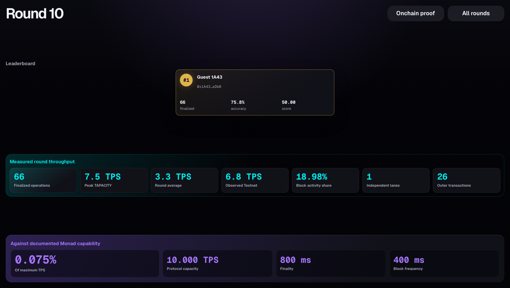
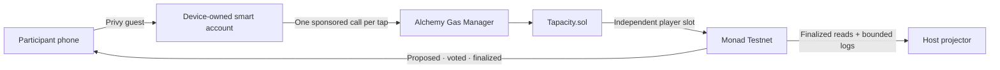

<div align="center">

# TAPACITY

### Turn a room of people into a live Monad execution experiment.

A 20-second competitive tapping game where every submitted tap is a separately authorized, sponsored onchain operation—and only finalized, in-window taps score.

[](https://github.com/SebastianBoehler/tapacity/actions/workflows/ci.yml)
[](https://docs.monad.xyz/developer-essentials/testnet)
[](https://web-alpha-six-19.vercel.app/)
[](https://testnet.monadexplorer.com/address/0x6adA9a80D616Ce2Bd0FAaf0dD26c52E8f7985241)

**Live:** [web-alpha-six-19.vercel.app](https://web-alpha-six-19.vercel.app/)<br>
**Verified contract:** [`0x6adA9a80D616Ce2Bd0FAaf0dD26c52E8f7985241`](https://testnet.monadexplorer.com/address/0x6adA9a80D616Ce2Bd0FAaf0dD26c52E8f7985241)

[Play TAPACITY](https://web-alpha-six-19.vercel.app/) · [Host a round](https://web-alpha-six-19.vercel.app/host) · [Open Round 10](https://web-alpha-six-19.vercel.app/host?round=10) · [Inspect its 66 tap operations](https://web-alpha-six-19.vercel.app/host/proof?round=10)

</div>



## The experience

About fifteen people scan one QR code, continue as zero-cost guests, privately commit a predicted tap count, and tap as fast as they can. The host starts one shared block-defined round.

Each phone shows taps progressing through attempted, submitted, proposed, voted, and finalized states. Goals and ranking stay hidden until settlement. Then TAPACITY reveals:

1. A competitive podium on the projector.
2. A personal Chainprint on every phone: goal, finalized taps, accuracy, latency, failures, and explorer evidence.
3. Whole-room throughput and latency beside clearly separated, documented Monad capacity figures.

The score rewards both output and prediction accuracy:

```text
accuracy = min(goal, finalized taps) / max(goal, finalized taps)
score    = finalized taps × accuracy
```

## Why Monad

TAPACITY is designed around Monad's execution architecture rather than merely deployed to an EVM chain.

| Monad property | What TAPACITY makes visible |
| --- | --- |
| Asynchronous consensus and execution | Each phone follows accepted operations through proposed, voted, and finalized commitment states using `monadLogs` and `monadNewHeads`. |
| Optimistic parallel execution | Every player writes to an independent storage lane. The contract never updates a shared global counter on every tap. |
| 400 ms blocks and 800 ms finality | A short physical game can expose multiple blocks and commitment transitions while the audience is still watching. |
| Documented 10,000 TPS protocol capacity | The projector compares measured TAPACITY and observed Testnet activity with documented capacity while explicitly avoiding a maximum-throughput claim. |
| MonadDB-backed authenticated state | Finalized contract reads and bounded log replay reconstruct a round without an application database. The browser does not claim to benchmark MonadDB. |

TAPACITY measures its application and the blocks containing its operations. It does **not** claim that one room benchmarks Monad's maximum.

## One tap, one operation

Every physical tap creates one distinct sponsored contract call with its own nonce key. Alchemy may pack several separately authorized operations into one outer transaction. TAPACITY never silently batches physical taps: it reports attempted, submitted, finalized, late, and failed counts separately.

Canonical proof uses the outer transaction hash plus log index, so every accepted `TapRecorded` operation remains independently identifiable even when explorer hashes repeat. [Round 10 proves 66 accepted operations across 26 outer transactions](https://web-alpha-six-19.vercel.app/host/proof?round=10).

## Architecture



- **Player identity:** Privy guest embedded wallet; no extension, seed phrase, or participant funds.
- **Tap path:** device-owned smart account with Alchemy gas sponsorship and parallel nonce keys.
- **Game contract:** block-bounded commit/reveal, independent per-player taps, deterministic settlement and ranking.
- **Data path:** direct finalized reads plus bounded round logs; no database, indexer, or self-hosted node.
- **Host path:** create, start, settle, reopen any historical round, and present its onchain proof.

## Contract guarantees

- Taps score only inside `[startBlock, endBlock)`.
- `keccak256(roundId, player, goal, salt)` keeps predictions private during play.
- Goals reveal only after tapping ends.
- `settleRound` is permissionless after the reveal window.
- Ties resolve by accuracy, finalized taps, earliest qualifying tap, then address.
- Total room taps are aggregated only during settlement—not written globally on every tap.

Verified contract: [`0x6adA…5241`](https://testnet.monadexplorer.com/address/0x6adA9a80D616Ce2Bd0FAaf0dD26c52E8f7985241) on Monad Testnet (`10143`).

## Stack

| Layer | Technology |
| --- | --- |
| Web | Next.js App Router, React, TypeScript, viem |
| Guest onboarding | Privy embedded guest wallets |
| Sponsored taps | Alchemy Wallet APIs and Gas Manager |
| Contracts | Solidity and Foundry with Monad configuration |
| Realtime state | Monad commitment-state WebSocket subscriptions |
| Deployment | Vercel and verified Monad Testnet contract |

## Run locally

Requirements: Node.js 22+, pnpm 10+, and Foundry.

```bash
git clone https://github.com/SebastianBoehler/tapacity.git
cd tapacity
cp web/.env.example web/.env.local
pnpm --dir web install --frozen-lockfile
pnpm --dir web dev
```

Configure `web/.env.local` with Privy, Alchemy, the Monad RPC, sponsorship policy, deployed contract, and server-only host wallet values described in [`web/.env.example`](./web/.env.example). Never expose `TAPACITY_ADMIN_PRIVATE_KEY` through a `NEXT_PUBLIC_` variable.

Run the focused verification suite:

```bash
pnpm --dir web test
pnpm --dir web lint
pnpm --dir web build
forge test --root contracts
```

## Repository

```text
contracts/  Foundry contract, scripts, and essential invariant tests
web/        Next.js player, host, realtime feed, sponsorship, and proof UI
docs/       Approved demo contract, deployment runbook, and Monad research
screenshots/ Real onchain product evidence
```

Built for **Monad Blitz Amsterdam 2026**.
